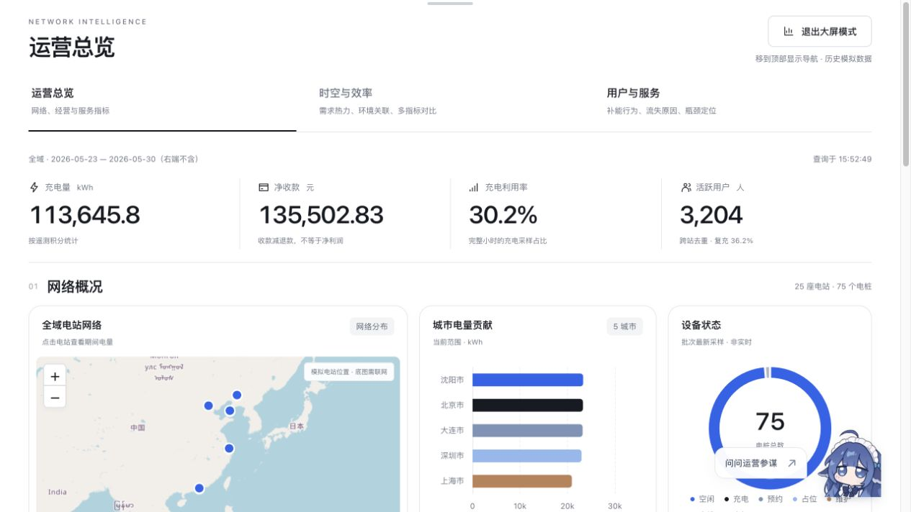
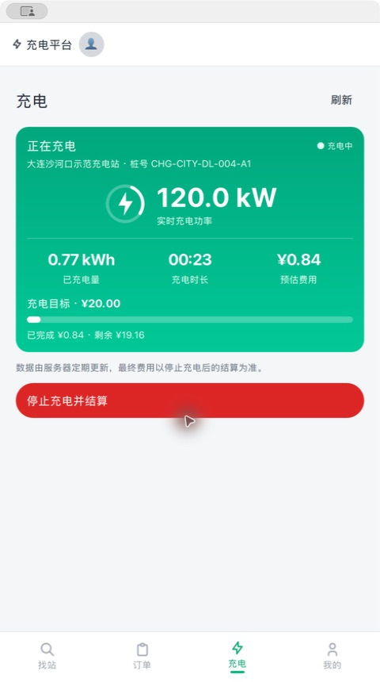
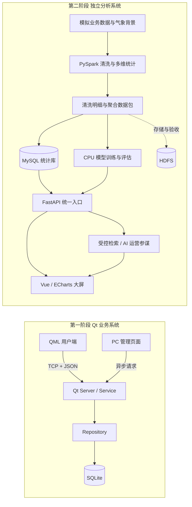

# 电动汽车充电桩应用管理平台 · 充能智析

从充电业务到运营决策的两阶段实训项目：第一阶段使用 **Qt 6.2.4** 实现用户端、PC 管理端与充电业务闭环；第二阶段使用 **PySpark、MySQL、FastAPI、Vue 3 与机器学习**，把多源模拟数据转化为可解释的运营指标、预测和决策参考。

本仓库保留两阶段完整代码、数据集、自动化测试和交付说明。它是教学演示系统，充电设备、资金交易及运营业务均为模拟，不代表真实充电网络的生产系统。

[第二阶段启动指南](data_analysis/delivery/README.md) · [数据集说明](data_analysis/README.md) · [最终演示与验收](data_analysis/docs/final_delivery.md) · [CI 运行记录](https://github.com/ggbondbest/qt-charging-platform/actions/workflows/data-analysis.yml)



## 项目交付内容

### 第一阶段 · Qt 充电平台

| 模块 | 已实现的主要能力 |
| --- | --- |
| QML 用户端 | 手机号登录与自动注册、五城市找站、地址定位与路线、预约/取消、动态充电、订单结算、余额与充值记录 |
| 充电服务 | 预约 → 开始充电 → 计费 → 停止 → 待支付 → 支付完成；服务端状态机、事务、费率快照与整数计费 |
| 扩展业务 | 指定电桩 FIFO 排队与自动叫号、报障与维修时间轴、按金额/电量/时长目标自动停止 |
| PC 管理端 | 管理员认证、运营概览、电站/电桩管理、用户冻结与解冻、订单、充值、操作日志、排队与维修 |
| 通信与存储 | 真实 TCP + JSON、请求编号与会话隔离、异步管理请求、独立业务工作线程；SQLite Schema v5、20 张表 |

同一服务端持有业务数据库。用户端不直连数据库，页面不直接写 SQL；重复支付、预约到期、叫号超时等规则由服务端统一处理。

<details>
<summary>查看 Qt 用户端实际运行界面</summary>



示例为模拟充电。达到目标后自动停止并进入待支付状态，用户也可提前手动结束。

</details>

### 第二阶段 · 运营大屏与智能分析

| 入口 | 展示内容与用途 |
| --- | --- |
| 运营总览 | 城市/日期筛选，电量、净收款、利用率、活跃用户、电站地图、趋势与排名；支持大屏模式 |
| 时空与效率 | 城市/站型/时段热力图、站点效率气泡、气象关联与指标相关矩阵，定位高峰和效率差异 |
| 用户与服务 | 补能行为分布、需求流向、失败原因、站型 × 小时瓶颈、四层用户画像，识别服务损失来源 |
| 智能找站 | 地图设置出发点，结合到站可用概率、等待、价格、距离和负荷均衡推荐电站；显示理由、积分标签与路线预览 |
| 智能分析 | 1/6/24 小时负荷与空闲桩预测、未来 14 天未回访风险、结束会话异常复核；展示当前模型与基线指标 |
| AI 运营参谋 | 全站聊天入口；支持本地统计问答，可选在线检索聚合、模型报告和项目知识，生成带来源引用的回答 |
| 模拟控制台 | 管理员令牌验证、历史回放时钟、最近站与智能推荐配对实验 |

时空与效率、用户与服务是运营总览内的分析工作区。网页聚焦分析与决策，不重复展示一期的充电、支付和行程操作。

## 系统如何协作



两阶段可以独立启动。第二阶段使用可复现的数据批次，**不是从 Qt 的 SQLite 实时同步数据**；其只读统计库与模拟业务库也相互隔离。HDFS 用于数据存储和处理验收，网页与现有模型训练不要求先启动 Hadoop。

## 数据与分析特色

| 项目 | 当前交付规模 |
| --- | --- |
| 城市与资源 | 大连、沈阳、北京、上海、深圳；25 个模拟电站、75 个电桩 |
| 时间范围 | 2025-12-01 至 2026-05-29，共 180 天，按上海时区定义业务日 |
| 用户与数据种类 | 6,000 名虚拟用户及车辆，23 张关联表 |
| 原始数据 | 5,832,840 行，含遥测、电池、充电、支付退款、排队、预约、维修、成本等；不是 583 万次充电 |
| 清洗成果 | 121,539 条有效充电会话，清洗明细、隔离记录、规则清单与质量审计 |
| 多维分析 | 11 个基础分组维度、3 组交叉对比；另有 7 张高级聚合表及执行计划、批次和守恒证据 |
| 质量挑战 | 独立的 20 类脏数据挑战集，展示正式清洗器的修复、隔离和统计偏差处理 |

数据不是无约束的均匀随机数：生成器结合站型、车辆用途、工作日/节假日、到访时段、充电功率、停留及充后占位、SOC 连续性等规则，并保留参数与独立校验结果。

业务记录由程序生成，**当前交付未使用 Caltech ACN-Data 实测会话作为训练数据**。气象背景采用带来源署名的 ERA5 再分析，匿名样本聚合与 UrbanEV 仅作规律参考；它们不把模拟充电数据变成真实五城运营记录。模型确实训练和推理，但评估结果只描述当前数据与划分，不能直接外推现场效果。

详见 [数据规模与统计快照](data_analysis/docs/dataset_profile.md)、[生成规律与来源](data_analysis/docs/behavior_evidence.md)、[多维分析口径](data_analysis/docs/advanced_analytics.md)、[清洗挑战](data_analysis/docs/advanced-cleaning.md)。

## 快速开始

| 环境 | 第一阶段 Qt | 第二阶段大数据与网页 |
| --- | --- | --- |
| 语言与运行时 | C++17、Qt Framework **6.2.4** | Python **3.11/3.12**、Node.js **24** |
| 数据库 | SQLite / QSQLITE | MySQL **8.4**，统计库与业务库分离 |
| 构建与展示 | CMake 3.16+；Ubuntu 22.04 验收 | Vue 3、ECharts、FastAPI；Windows 开发、Linux 验证 |
| 额外依赖 | QML、Charts、WebEngine | 重跑 Spark 需 Java 17 与 Spark 依赖；HDFS 验收使用 Hadoop 3.x |

完整网页和模型使用 CPU 即可，不需要 GPU。仓库已有原始数据和清洗统计包；新环境仍需准备 MySQL、训练本地模型并构建前端。

### 第二阶段 · 先体验网页与机器学习

以下命令从**仓库根目录**开始。先确认 `python --version` 为 3.11 或 3.12。

**1. 创建并激活 Python 环境。**

```bash
python -m venv data_analysis/.venv
```

- Windows PowerShell：`.\data_analysis\.venv\Scripts\Activate.ps1`
- Linux：`source data_analysis/.venv/bin/activate`

```bash
python -m pip install -r data_analysis/requirements-delivery.txt
python -m data_analysis.publishing.acceptance_bundle --verify data_analysis/datasets/analytics_full_180d_v1
python -m data_analysis.delivery.cli train
```

训练读取已交付的 CLEAN 数据，无需先重跑 Spark。模型产物位于 `data_analysis/outputs/`，不随 Git 提交；完整且兼容的本地产物会被校验并复用。

**2. 准备 MySQL 和服务配置。此步骤不可跳过。**

按照 [首次准备与账号授权](data_analysis/delivery/README.md#2-首次准备) 完成：

- 设置 `ANALYTICS_MYSQL_HOST/PORT/DATABASE/USER/PASSWORD`，使用导入账号发布到**尚不存在的新统计库**。发布器不覆盖旧库。
- 服务改用只拥有 `SELECT` 权限的统计账号；另建独立业务库，设置 `CHARGEPILOT_MYSQL_HOST/PORT/DATABASE/USER/PASSWORD`。
- 需要模拟控制台时，设置至少 16 字符的随机 `CHARGEPILOT_ADMIN_TOKEN`。它不是一期的管理员密码；未设置时管理接口禁用。

首次发布命令（先配好导入账号，已有可用环境不要重复发布）：

```bash
python -m data_analysis.publishing.mysql_publish --input data_analysis/datasets/analytics_full_180d_v1 --report data_analysis/outputs/mysql-delivery-publication.json
```

发布成功后，将 `ANALYTICS_MYSQL_USER/PASSWORD` 切换为只读统计账号，再执行第 3 步。

数据库配置从进程环境读取，不会自动加载普通 `.env.example`。完整 SQL、环境变量和七表高级统计的可选追加安装见 [MySQL 配置说明](data_analysis/docs/mysql_setup.md)。不要删除原数据库来解决初始化问题。

**3. 构建网页并启动统一服务。**

```bash
cd data_analysis/frontend
npm ci
npm test
npm run build
cd ../..
python -m data_analysis.delivery.cli check
python -m data_analysis.delivery.cli serve
```

打开 **http://127.0.0.1:8000/**。接口文档位于 `/docs`，找站接口文档位于 `/api/v1/chargepilot/docs`。`check` 核对两库与模型，应用初始化会幂等建立业务表；请使用专用演示库。

完整展示只需这一个服务。前端开发可另开终端，进入 `data_analysis/frontend` 后运行 `npm run dev`，访问 http://127.0.0.1:5173；Vite 通过代理访问 8000 端口。不要把旧子系统的独立启动命令当作完整项目入口。

**4. 可选开启在线 AI。**

无 Key 时可用本地统计问答。需要在线问答时，将 `data_analysis/ml/advisor/.env.example` 复制为同目录 `.env.local`，配置自己的 Key 后重启统一服务。当前模板使用 AIPing 与 `DeepSeek-V4.1-Flash`，不需要额外训练或新服务。

在线主动发送会向供应商发送问题、有限历史、当前范围及选中的聚合/知识片段；不发送原始业务明细或完整数据包。Key 仅在后端，不能提交到仓库。配置有效不等于供应商连通成功，引用也不保证模型推断始终正确。详见 [AI 配置与数据边界](data_analysis/ml/advisor/README.md)。

### 第一阶段 · 构建 Qt 用户端与管理端

Qt Creator 是 IDE，其版本号不等于 Qt Framework 版本。验收脚本会强制使用 **Qt 6.2.4**，正式客户端为 QML，旧 Widgets 客户端默认不构建。

<details>
<summary>Ubuntu 22.04 依赖安装</summary>

```bash
sudo apt update
sudo apt install -y \
  build-essential cmake ninja-build sqlite3 python3 fonts-noto-cjk \
  qt6-base-dev qt6-base-dev-tools libqt6sql6-sqlite \
  qt6-declarative-dev qt6-declarative-dev-tools qt6-webengine-dev qt6-webengine-dev-tools \
  libqt6webenginecore6-bin libqt6charts6-dev \
  qml6-module-qtquick qml6-module-qtquick-window qml6-module-qtquick-layouts \
  qml6-module-qtquick-controls qml6-module-qtquick-templates \
  qml6-module-qtquick-dialogs qml6-module-qtqml qml6-module-qtqml-models \
  qml6-module-qtqml-workerscript qml6-module-qtwebengine
```

</details>

安装依赖后，构建并执行 Qt 测试、数据库及 QML 路由校验：

```bash
bash scripts/verify_delivery.sh
```

终端一启动服务端：

```bash
./build-delivery/server/charging-server --address 127.0.0.1 --port 9527 \
  --database ./runtime/demo.sqlite3 --demo-seed
```

终端二启动客户端：

```bash
./build-delivery/client/charging-client --host 127.0.0.1 --port 9527
```

演示管理员为 `admin / 123456`；演示用户 `13800138000` 初始余额为 100 元，新手机号注册余额为 0。`--demo-seed` 加载五城 25 站 / 75 桩演示目录，不代表真实商业电站。保留已有业务库，需要全新演示时选择新的 SQLite 文件名。

一期地址定位和路线需要自己的腾讯地图 Key，可设置 `TENCENT_MAP_API_KEY`；启用签名时另设 `TENCENT_MAP_SECRET_KEY`。接口权限、网络和底图需在运行环境验证，不能用 Mock 页面代替真实 TCP 联调。操作步骤见 [一期验收与地图配置](docs/development/delivery_acceptance.md)、[排队/维修/目标充电说明](docs/development/queue-repair-targets.md)。历史验收文档中的临时分支、PR 顺序和旧 Qt CI 条件不再作为本次发布入口。

## 仓库结构

```text
client/           Qt QML 用户端、网络与客户端服务
server/           Qt 管理端、工作线程、业务服务和仓储
common/           两端共享模型、协议和错误码
database/         SQLite Schema、迁移相关资源及演示数据
tests/            Qt 自动化测试
scripts/          Qt 构建、数据库及页面校验脚本
data_analysis/
  charging_data/  关联数据生成、脏数据注入与独立校验
  datasets/       原始数据、CLEAN、聚合包与质量证据
  spark_jobs/     PySpark 清洗、统计、特征和多维分析
  publishing/    批次发布与 MySQL 导入
  backend/       只读统计 API
  contracts/     OpenAPI、类型与数据契约
  delivery/      网页、统计与模型的统一启动入口
  frontend/      Vue 3、ECharts、地图及 AI 聊天界面
  ml/            预测、风险、异常与 AI 参谋
  chargepilot/   到站推荐、模拟业务兼容能力与配对实验
  tests/         数据、API、Spark、模型和交付回归
docs/            一期需求、架构、协议与协作记录
```

更细的目录职责和数据流见 [第二阶段目录说明](data_analysis/README.md)、[数据层交付](data_analysis/DATA_LAYER.md)、[公共接口契约](data_analysis/contracts/README.md)。

## 验证与交付边界

当前 [GitHub Actions](.github/workflows/data-analysis.yml) 展开为 **12 项检查**：

| 检查 | 覆盖范围 |
| --- | --- |
| Python 静态检查 ×1 | 语法、未定义名称等错误 |
| 数据生成与交付证据 ×2 | Linux/Windows、生成约束、数据包与质量证据 |
| API 与契约 ×2 | Linux/Windows、接口结构与批次一致性；Linux 含真实 MySQL |
| Spark ×5 | 清洗、脏数据解析、统计、ML 特征与数据导出 |
| ML 与 MySQL 集成 ×1 | 实际 CPU 训练、预测、集成接口、参谋回归与配对仿真 |
| Vue ×1 | 前端测试、类型检查与构建 |

AI 在线协议在 CI 中使用测试传输，不要求真实 Key 或付费调用。CI 配置和历史通过记录不等于本次检查已通过，应查看当前提交的运行结果。一期 Qt 自动工作流已移除，测试代码和 `verify_delivery.sh` 手工验证入口仍保留。

- 统计数据采用固定历史批次；日期筛选的结束日不包含当天，设备快照不冒充实时库存。
- 地图底图需联网，默认到站时间为情景估计；外部真实路线不可用时明确提示，不伪造导航成功。
- 用户未回访风险不等于永久流失概率；会话异常筛查不等于实时电池安全诊断。
- HDFS 验证、第三方地图和在线模型可用性，应在实际交付环境独立确认。七天报修预测和扩容规划研究不属于最终交付入口。
- 系统面向教学与受控局域网。Qt TCP 不提供 TLS，二期体验身份也不是生产账号体系；不要把演示密码、MySQL 或管理员接口直接暴露到公网。

## 文档与维护

| 想了解什么 | 从这里开始 |
| --- | --- |
| 第二阶段完整安装与运行 | [统一交付指南](data_analysis/delivery/README.md) |
| 最终范围、验证及演示顺序 | [最终交付与验收](data_analysis/docs/final_delivery.md) |
| 数据准备和清洗如何展示 | [清洗与准备验收](data_analysis/docs/cleaning_acceptance.md) |
| 多维图表的指标与计算口径 | [高级分析说明](data_analysis/docs/advanced_analytics.md) |
| Qt 协议与业务链路 | [Socket 协议](docs/api/socket_protocol.md)、[线程设计](docs/development/server_threading.md) |
| 当前 SQLite 表结构 | [Schema 源码](database/schema.sql) |
| Qt 兼容性要求 | [Qt 6.2.4 兼容规范](docs/development/qt_6_2_4_compatibility.md) |
| 协作与贡献记录 | [贡献指南](CONTRIBUTING.md)、[历史 PR](https://github.com/ggbondbest/qt-charging-platform/pulls?q=is%3Apr+is%3Amerged) |

`master` 用于稳定发布，`develop` 保留为集成分支。后续修改通过功能分支与 PR 审查；阶段发布可以使用独立发布分支，**不删除 develop**。历史设计文档保留当时的迭代记录，最终运行方式与功能范围以本页及统一交付指南为准。

项目由五人协作完成，具体作者、代码审查和集成过程保留在 Git 历史中。感谢指导教师成宝宗、田丽英及组员的指导与协作。
